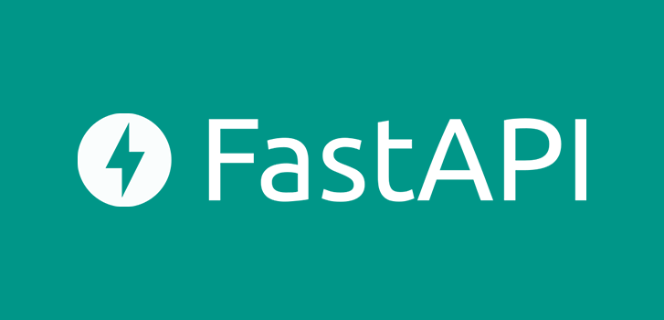

# Фреймворки Flask и FastAPI
# Home work 5 (Знакомство с FastAPI)

## Задание:
## 1. <b>main_users.py</b>
Необходимо создать API для управления списком пользователей. 

API должен содержать следующие конечные точки:
> — GET /users — возвращает список всех пользователей.

> — GET /users/{id} — возвращает пользователя с указанным идентификатором.

> — POST /users — добавляет нового пользователя.

> — PUT /users/{id} — обновляет пользователя с указанным идентификатором.

> — DELETE /users/{id} — удаляет пользователя с указанным идентификатором.

Для каждой конечной точки необходимо проводить валидацию данных запроса и ответа. 
Для этого использовать библиотеку Pydantic.

## 2. <b>main_tasks.py</b>
Необходимо создать API для управления списком задач. 
Каждая задача должна содержать заголовок и описание. 
Для каждой задачи должна быть возможность указать статус (выполнена/не выполнена).

API должен содержать следующие конечные точки:
> — GET /tasks — возвращает список всех задач.

> — GET /tasks/{id} — возвращает задачу с указанным идентификатором.

> — POST /tasks — добавляет новую задачу.

> — PUT /tasks/{id} — обновляет задачу с указанным идентификатором.

> — DELETE /tasks/{id} — удаляет задачу с указанным идентификатором.

Для каждой конечной точки необходимо проводить валидацию данных запроса и ответа. Для этого использовать библиотеку Pydantic

## 3. <b>first_program.py</b>

> — Первая программа на FastAPI