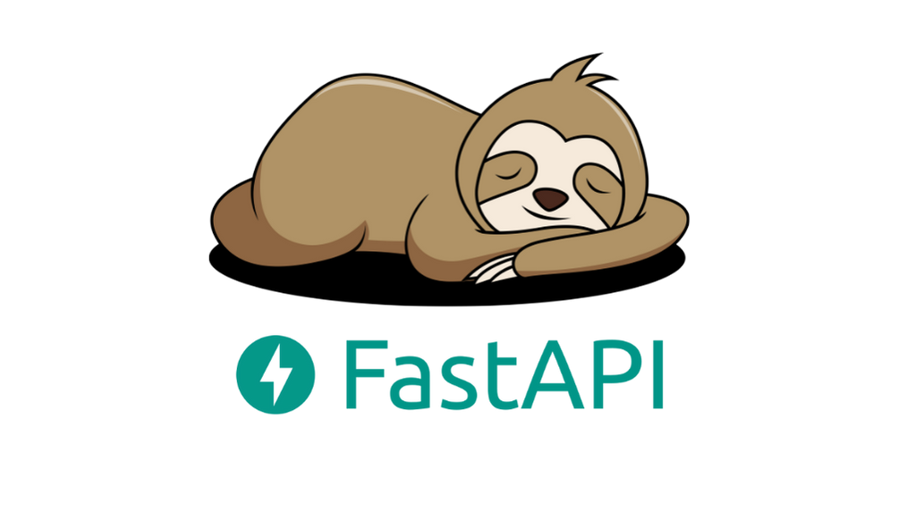

# Фреймворки Flask и FastAPI
# Home work 6 - (Дополнительные возможности FastAPI)

# <b>Задание:</b>

## <i>Необходимо создать базу данных для интернет-магазина. База данных должна состоять из трёх таблиц: 
- товары, 
- заказы,
- пользователи

## Таблица «Товары» должна содержать: 
- информацию о доступных товарах,
- их описание, 
- цена

## Таблица «Заказы» должна содержать:
- информацию о заказах, сделанных пользователями.

## Таблица «Пользователи» должна содержать:
- информацию о зарегистрированных пользователях магазина.

## Таблица пользователей должна содержать следующие поля: 

> 1. id (PRIMARY KEY), 

> 2. имя, 

> 3. фамилия, 

> 4. адрес электронной почты,

> 5. пароль

## Таблица заказов должна содержать следующие поля: 

> 1. id (PRIMARY KEY), 

> 2. id пользователя (FOREIGN KEY), 

> 3. id товара (FOREIGN KEY), 

> 4. дата заказа,

> 5. статус заказа.

## Таблица товаров должна содержать следующие поля:

> 1. id (PRIMARY KEY), 

> 2. название, 

> 3. описание,

> 4. цена.</i></b>

 
 

* Создайте модели pydantic для получения новых данных и возврата существующих в БД для каждой из трёх таблиц.
* Реализуйте CRUD операции для каждой из таблиц через создание маршрутов, REST API. (итого 15 маршрутов). 
> * * Чтение всех
> * * Чтение одного
> * * Запись
> * * Изменение
> * * Удаление

## <b>Критерии оценивания:</b>
1. Слушатель создал базу данных для интернет-магазина. База данных должна состоять из трёх таблиц: товары, заказы и пользователи.
2. Таблица «Товары» должна содержать информацию о доступных товарах, их описаниях и ценах.
3. Таблица «Заказы» должна содержать информацию о заказах, сделанных пользователями.
4. Таблица «Пользователи» должна содержать информацию о зарегистрированных пользователях магазина.